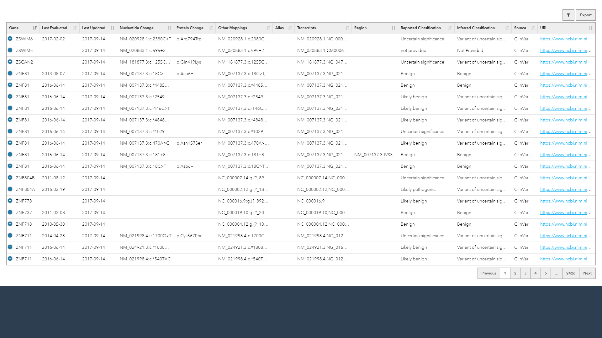
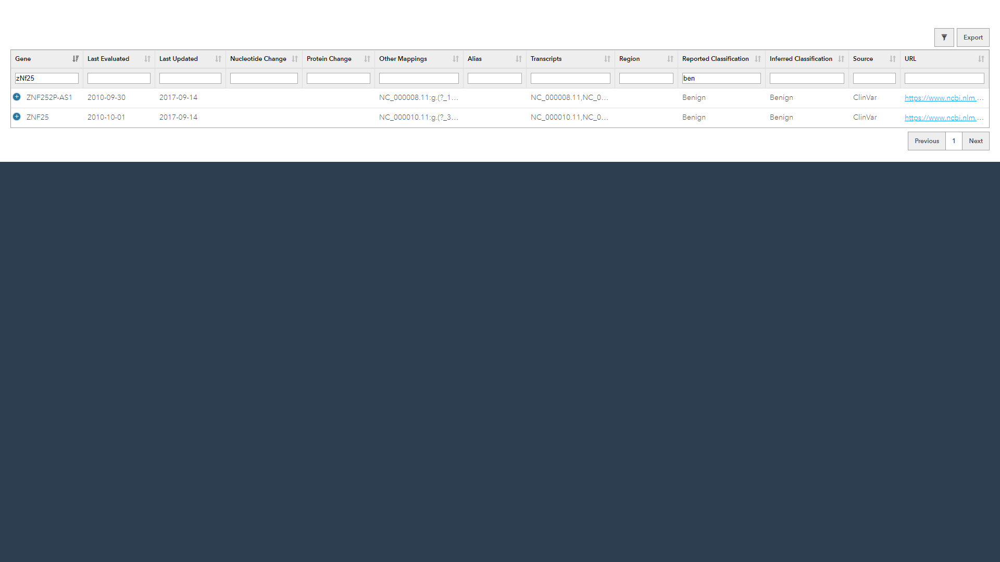

# Variant Search Coding Assignment

## Access online (PHP, JavaScript, MySQL)
In addition to the local server, there is a version of the application running online using PHP, MySQL, and JavaScript. This can be accessed from [http://semeon.io/a/invitae](http://semeon.io/a/invitae).

## Run on local server (Django)
### Dependencies
- [Python 3.6+](https://www.python.org/downloads/)
- [djangorestframework>=3.10.3](https://pypi.org/project/djangorestframework/)
- [djangorestframework_datatables>=0.5.0](https://pypi.org/project/djangorestframework-datatables/)
- [Django>=2.2.7](https://pypi.org/project/Django/)

### Procedure
The following steps will help run the invitae Django application. Note: Example command line code below is for Windows OS. Most commands should be applicable on Linux machines.

#### Download GitHub repo
The GitHub repo is found at [https://github.com/risoms/invitae](https://github.com/risoms/invitae).

#### (Optional) Generate 'requirements.txt' file
The [reqiurements.txt](./reqiurements.txt) file has already been pre-made. To recreate it, you can either: running the associated .bat file ([/bin/1.requirements.bat](./bin/1.requirements.bat)) or manually by running the following code:

	python ./lib/pipreqs/pipreqs.py ./app/ --encoding=iso-8859-1 --debug --force --version=greater --savepath=requirements.txt

#### (Optional) Create a python virtual environment
The virtual environment has been included as part of the GitHub repo. Recreating it can be done with the [/bin/2.virtualenv.bat](./bin/2.virtualenv.bat) file, or by running the following code:

	REM create virtualenv
	python -m virtualenv env

	REM activate virtualenv
	.\env\Scripts\activate.bat

	REM download dependencies directly from pip
	pip install -r requirements.txt

#### Run Django server
Once the server is running, access it by going to [http://127.0.0.1:8000/variants/](http://127.0.0.1:8000/variants/). You can start the server by using the [/bin/3.run.bat](./bin/3.run.bat) file, or by running the following code:

	REM activate virtualenv, run server
	env\Scripts\activate.bat && cd app && python manage.py runserver

Here is an an example of what the dashboard looks like after running the server.

#### Run Django unit test
To run a unit test, either run the [/bin/4.tests.bat](./bin/4.tests.bat) file, or the following code:

	REM activate virtualenv, run unit test
	.\env\Scripts\activate.bat && cd app && python manage.py test invitae

### Notes
- To make a filter, press the filter icon then include your query into the corresponding input below each column header. In the example, both **Gene** and **Reported Classification** both have filering criteria.

- Data can be exported by clicking on the Export button. This will create a .csv with the current ISODATE as the default filename. Note: Because exporting is a front-end function using DataTables, only data already loaded will be accessable to export.